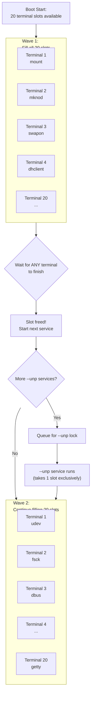

initRC 
is more leaner than other init system well it's just a concept for now. i dont have enough time these days to manage and make it real.

the core idea is to use those extra 50% of unused cpu pressure at work and make the device more faster 
initRC will run different command in different virtual terminals if one command finishes it will run another making the bootup speed faster unlike the traditional 1 command at a time method 
it could run all services ( 30+ ) at once but we will limit it to 10 slots. but user could control how many they want to run at once and after graphical session turns on it will has another type of limiter which would be disabled by default but user could enable how many daemons to run simultaneously.

exceptional command line arguments.
--unp ( unparallel ) tag : its a new command line argument that ensures that a service doesn't runs simultaneously with other service
--switch above/below to control the position to run it.
( and other ordinary init command line arguments )

Making the boot very faster..
